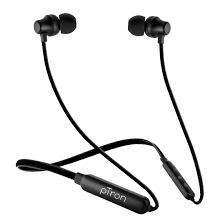
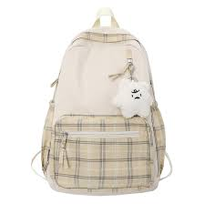
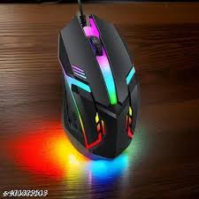
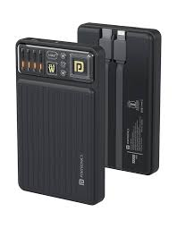
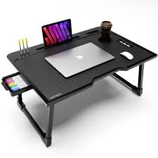
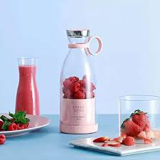

# Ex02 Commercial Website
## Date: 31/8/2025

## AIM
To create a commercial website using CSS Flexbox.

## ALGORITHM
### STEP 1
Create an HTML file (index.html)

### STEP 2
Create a CSS file (style.css)

### STEP 3
Include a navigation bar with links to different sections.

### STEP 4
Add structured sections for Homepage, Products / Services, About Us, Contact Details and User Account.

### STEP 5
Include social media links at the footer with copyright information.

### STEP 6
Define global styles for fonts, colors, and layout.

### STEP 7
Style the header, navigation bar, and sections.

### STEP 8
Use Flexbox for layout design.

### STEP 9
Add hover effects and transitions for interactivity.

### STEP 10
Add Images and Media.

### STEP 11
Use optimized images for a professional look.

### STEP 12
Open the HTML file in a browser to check layout and functionality.

### STEP 13
Fix styling issues and refine content placement.

### STEP 14
Deploy the website.

### STEP 15
Upload to GitHub Pages for free hosting.

## PROGRAM
```
<!DOCTYPE html>
<html lang="en">
<head>
  <meta charset="UTF-8">
  <meta name="viewport" content="width=device-width, initial-scale=1.0">
  <title>My E-Commerce Website</title>
  <link rel="icon" type="image/png" href="image.png">
  <link rel="stylesheet" href="ex2.css">
</head>
<body>

  <!-- Header -->
  <header>
    <div class="logo">ShopEasy</div>
    <nav>
      <ul class="nav-links">
        <li><a href="#home">Home</a></li>
        <li><a href="#products">Products</a></li>
        <li><a href="#about">About</a></li>
        <li><a href="#contact">Contact</a></li>
        <li><a href="#cart">Cart 🛒 <span id="cart-count">0</span></a></li>
      </ul>
    </nav>
  </header>

  <!-- Hero -->
  <section class="hero" id="home">
    <h1>Welcome to ShopEasy</h1>
    <p>"The art of shopping is to buy things you love"</p>
  </section>

  <!-- Products -->
  <section class="products" id="products">
    <h2>Featured Products</h2>
    <div class="product-grid">

      <div class="product-card">
        
        <h3>Wireless Headphones</h3>
        <p>$839.00</p>
        <button onclick="addToCart('Wireless Headphones', 839)">Add to Cart</button>
      </div>

      <div class="product-card">
        
        <h3>Smart Watch</h3>
        <p>$1,999.00</p>
        <button onclick="addToCart('Smart Watch', 1999)">Add to Cart</button>
      </div>

      <div class="product-card">
        
        <h3>Sneakers</h3>
        <p>$679.00</p>
        <button onclick="addToCart('Sneakers', 679)">Add to Cart</button>
      </div>

      <div class="product-card">
        
        <h3>Backpack</h3>
        <p>$499.00</p>
        <button onclick="addToCart('Backpack', 499)">Add to Cart</button>
      </div>

      <div class="product-card">
        
        <h3>Laptop</h3>
        <p>$32,999.00</p>
        <button onclick="addToCart('Laptop', 32999)">Add to Cart</button>
      </div>

      <div class="product-card">
        
        <h3>Smartphone</h3>
        <p>$11,259.00</p>
        <button onclick="addToCart('Smartphone', 11259)">Add to Cart</button>
      </div>

      <div class="product-card">
        
        <h3>Gaming Mouse</h3>
        <p>$399.00</p>
        <button onclick="addToCart('Gaming Mouse', 399)">Add to Cart</button>
      </div>

      <div class="product-card">
        
        <h3>Bluetooth Speaker</h3>
        <p>$869.00</p>
        <button onclick="addToCart('Bluetooth Speaker', 869)">Add to Cart</button>
      </div>

      <div class="product-card">
        
        <h3>Power Bank</h3>
        <p>$899.00</p>
        <button onclick="addToCart('Power Bank', 899)">Add to Cart</button>
      </div>

      <div class="product-card">
        
        <h3>DSLR Camera</h3>
        <p>$999.00</p>
        <button onclick="addToCart('DSLR Camera', 999)">Add to Cart</button>
      </div>

      <div class="product-card">
        
        <h3>Study Table</h3>
        <p>$499.00</p>
        <button onclick="addToCart('Study Table', 499)">Add to Cart</button>
      </div>

      <div class="product-card">
        
        <h3>Juicer</h3>
        <p>$459.00</p>
        <button onclick="addToCart('Juicer', 459)">Add to Cart</button>
      </div>

    </div>
  </section>

  <!-- About -->
  <section class="about" id="about">
    <h2>About Us</h2>
    <p>
      ShopEasy is your trusted online marketplace, offering good quality products at affordable prices.
      Our mission is to make shopping easy and fun for everyone.
    </p>
  </section>

  <!-- Contact -->
  <section id="contact" class="contact">
    <h2>Contact Information</h2>
    <p>You can reach me here:</p>

    <div class="contact-info">
      <p><strong>Email:</strong> <a href="mailto:yourmail@example.com">yourmail@example.com</a></p>
      <p><strong>Phone:</strong> +91 98765 43210</p>
    </div>
  </section>

  <!-- Cart -->
  <section class="cart" id="cart">
    <h2>Your Cart</h2>
    <ul id="cart-items"></ul>
    <p id="cart-total">Total: $0</p>
  </section>

  <!-- Footer -->
  <footer>
    <p>© 2025 ShopEasy | Muthulakshmi D</p>
  </footer>

  <script src="ex2.js"></script>
</body>
</html>

```
```
* {
  margin: 0;
  padding: 0;
  box-sizing: border-box;
  font-family: Arial, sans-serif;
}

body {
  background: #f9f9f9;
  color: #333;
  line-height: 1.6;
}

/* Header */
header {
  background: #333;
  color: #fff;
  padding: 15px 20px;
  display: flex;
  justify-content: space-between;
  align-items: center;
  position: sticky;
  top: 0;
  z-index: 1000;
}
.logo {
  font-size: 1.5rem;
  font-weight: bold;
}
.nav-links {
  list-style: none;
  display: flex;
}
.nav-links li {
  margin-left: 20px;
}
.nav-links a {
  color: #fff;
  text-decoration: none;
}
.nav-links a:hover {
  color: #19c254;
}

/* Hero */
.hero {
  background: #4028ca;
  color: #fff;
  text-align: center;
  padding: 70px 20px;
}
.hero h1 {
  font-size: 2.5rem;
  margin-bottom: 10px;
}

/* Products */
.products {
  padding: 50px 20px;
  text-align: center;
}
.product-grid {
  display: grid;
  grid-template-columns: repeat(auto-fit, minmax(220px, 1fr));
  gap: 20px;
}
.product-card {
  background: #fff;
  border: 1px solid #ddd;
  border-radius: 8px;
  padding: 15px;
  transition: transform 0.2s ease-in-out;
}
.product-card:hover {
  transform: translateY(-5px);
}
.product-card img {
  width: 100%;
  height: 150px;
  object-fit: cover;
  margin-bottom: 10px;
}
.product-card button {
  background: #1a97b3;
  color: #fff;
  border: none;
  padding: 10px;
  margin-top: 10px;
  cursor: pointer;
  border-radius: 5px;
  transition: 0.3s;
}
.product-card button:hover {
  background: #14798f;
}

/* About */
.about {
  background: #fff;
  padding: 50px 20px;
  margin-top: 30px;
  text-align: center;
}

/* Contact (Info Page Only) */
.contact {
  background: #fff;
  padding: 60px 20px;
  text-align: center;
}
.contact h2 {
  font-size: 2rem;
  margin-bottom: 20px;
  color: #333;
}
.contact-info {
  font-size: 1.1rem;
  line-height: 1.8;
}
.contact-info a {
  color: #ff9800;
  text-decoration: none;
}
.contact-info a:hover {
  text-decoration: underline;
}

/* Cart */
.cart {
  padding: 50px 20px;
  background: #fff;
  margin: 30px;
  border-radius: 8px;
}
#cart-items li {
  margin: 5px 0;
}
#cart-total {
  font-weight: bold;
  font-size: 1.2rem;
  margin-top: 15px;
}

/* Footer */
footer {
  background: #333;
  color: #fff;
  text-align: center;
  padding: 20px;
}

```
```
let cart = [];
let total = 0;

function addToCart(product, price) {
  cart.push({ product, price });
  total += price;
  updateCart();
}

function updateCart() {
  const cartItems = document.getElementById("cart-items");
  const cartCount = document.getElementById("cart-count");
  const cartTotal = document.getElementById("cart-total");

  cartItems.innerHTML = "";

  cart.forEach((item) => {
    let li = document.createElement("li");
    li.textContent = `${item.product} - $${item.price}`;
    cartItems.appendChild(li);
  });

  cartCount.textContent = cart.length;
  cartTotal.textContent = `Total: $${total}`;
}
```
## OUTPUT


## RESULT
The program for creating commercial website using CSS Flexbox is executed successfully.
